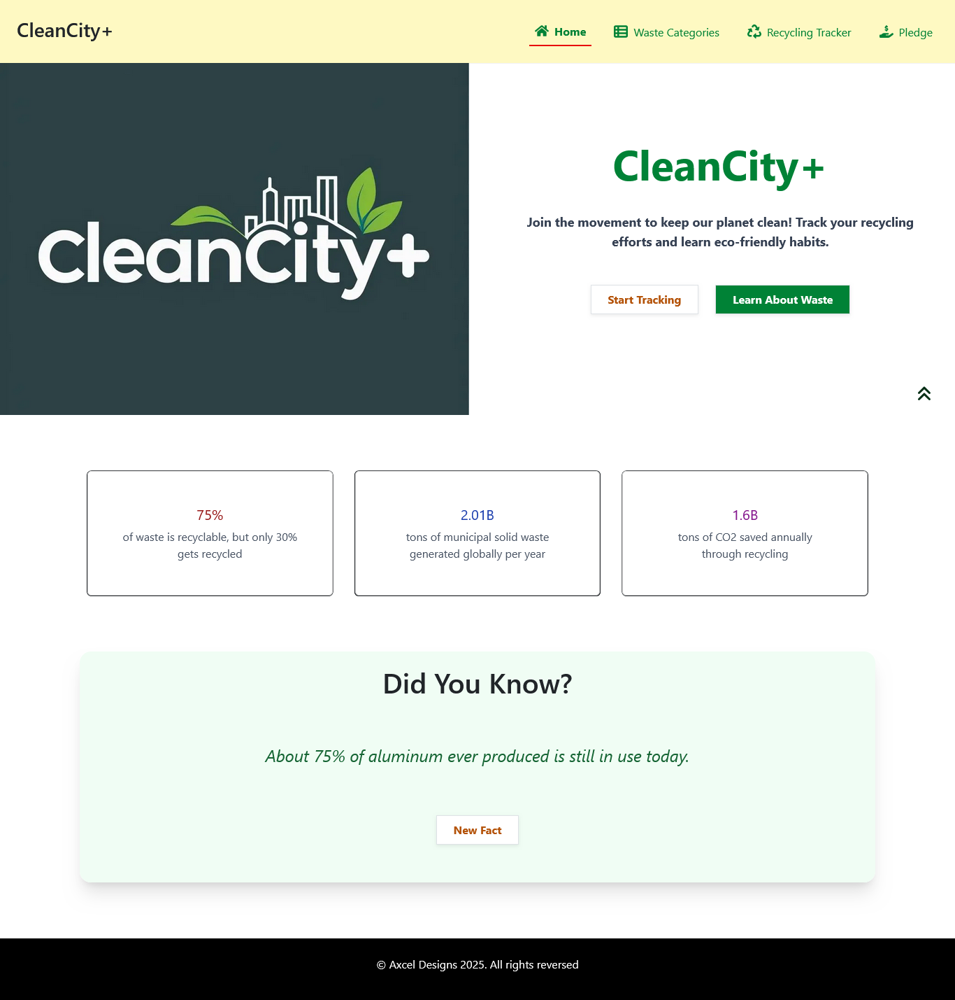
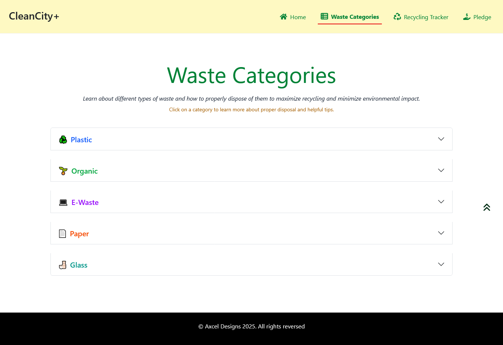
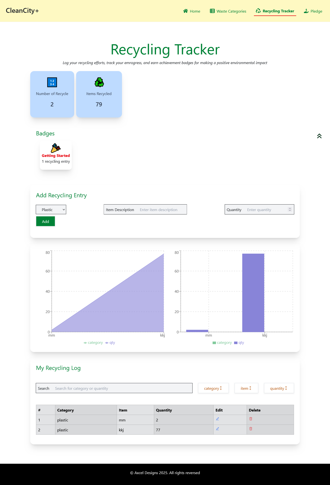
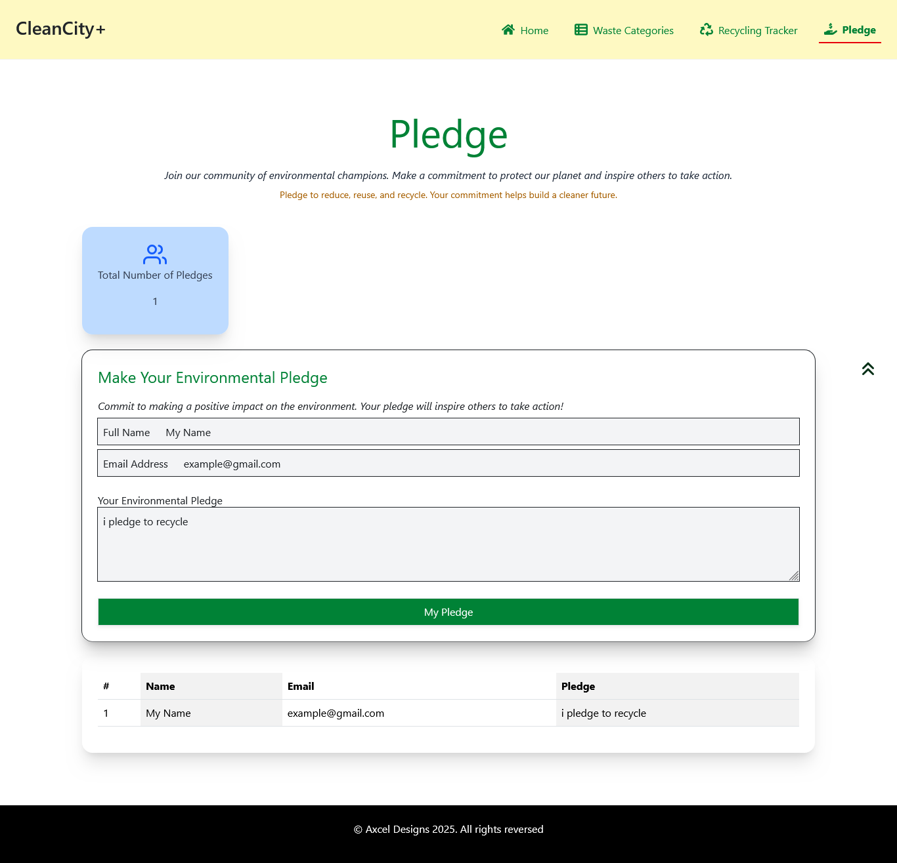

# CleanCity+ – Interactive Waste Management Tracker

**Live Demo:** [cleancity-plus.vercel.app](https://cleancity-plus.vercel.app/)

---

## 📖 Project Brief

CleanCity+ is a **Next.js (React) App Router web app** that educates users on waste categories and helps them **log, track, and visualize their recycling efforts**.  
It emphasizes **React fundamentals** (components, props, state, hooks) and **JavaScript interactivity** (CRUD operations, search, charts, and persistence with localStorage).

---

## 🎯 Core Features

1. **Homepage**
   - Navbar with links to Home, Waste Categories, Recycling Tracker, Pledge
   - Hero section with call-to-action
   - Random “Did You Know?” fact generator

2. **Waste Categories**
   - Accordion (React-Bootstrap) for Plastic, Organic, E-waste, Paper, Glass
   - Each section contains tips and disposal info

3. **Recycling Tracker**
   - TrackerForm to add items (category + quantity)
   - TrackerTable to view, edit, and delete logs
   - Persist data with `localStorage`
   - Search & sort functionality
   - Chart (Recharts) showing totals per category
   - Achievement badges when milestones are hit

4. **Pledge Page**
   - Users submit a pledge
   - Pledges stored in `localStorage`
   - Live pledge counter

5. **Responsive Design**
   - Built with React-Bootstrap grids, Tailwind utilities, and responsive tables

---

## 🛠️ Tech Stack

- [Next.js 15+ (App Router)](https://nextjs.org/docs/app)
- [Tailwind CSS](https://tailwindcss.com/)
- [React-Bootstrap](https://react-bootstrap.github.io/)
- [Recharts](https://recharts.org/)
- [localStorage API](https://developer.mozilla.org/en-US/docs/Web/API/Window/localStorage)

---

## 📸 Preview

Here are some screenshots of **CleanCity+** in action:

### Homepage



### Waste Categories



### Recycling Tracker



### Pledge Page



## 📦 Installation

### 1. Clone the repository

```bash
git clone https://github.com/your-username/cleancity-plus.git
cd cleancity-plus
```

### 2. Install dependencies

```bash
npm install
npm install react-bootstrap bootstrap recharts react-icons
```

### 3. Run the development server

```bash
npm run dev
```

### 4. Build for production

```bash
npm run build
npm start
```
